# WSL UI User Guide

A complete guide to managing your WSL distributions with WSL UI.

## Table of Contents

- [Dashboard Overview](#dashboard-overview)
- [Managing Distributions](#managing-distributions)
- [Quick Actions](#quick-actions)
- [Installing New Distributions](#installing-new-distributions)
- [Backup and Restore](#backup-and-restore)
- [Custom Actions](#custom-actions)
- [Settings](#settings)
- [Themes](#themes)
- [Keyboard Shortcuts & Accessibility](#keyboard-shortcuts--accessibility)

---

## Dashboard Overview

The main dashboard shows all your WSL distributions at a glance.

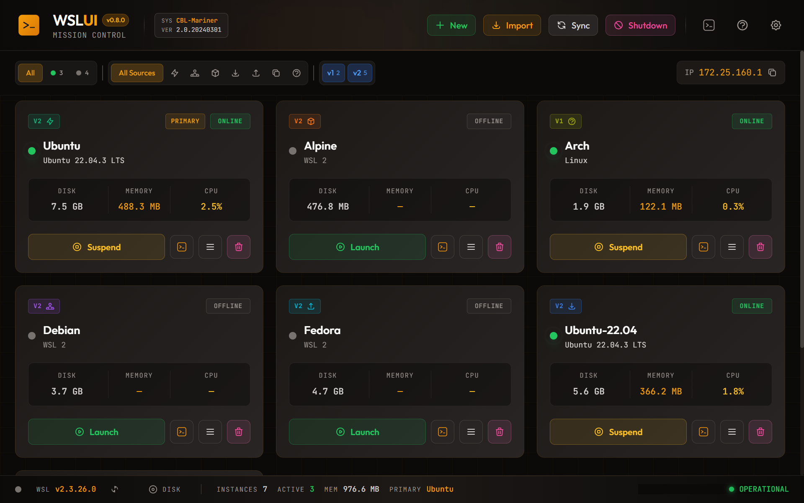

Each distribution card displays:
- **Name** and Linux distribution info
- **Status badge** - Running (green) or Stopped (gray)
- **WSL version** - WSL 1 or WSL 2
- **Resource usage** - CPU, memory, and disk when running
- **Source badge** - How the distribution was installed (Store, Container, Import, etc.)

### Filtering Distributions

Use the filter bar to find specific distributions:

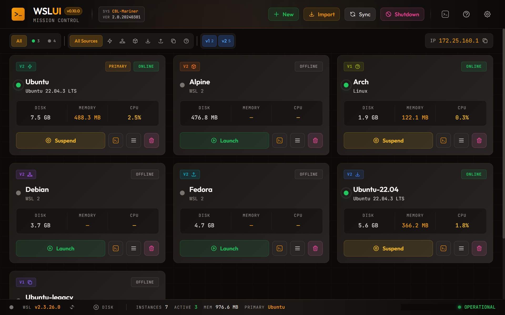

- **Status** - Show only running or stopped distributions
- **Source** - Filter by installation method
- **WSL Version** - Show only WSL 1 or WSL 2

### Status Bar

The status bar at the bottom of the dashboard shows:
- Health status indicator
- WSL version with update button
- Mounted disks count
- Distribution count (instances/active)
- Total memory usage
- Default distribution name

---

## Managing Distributions

### Quick Actions Menu

Right-click any distribution or use the menu button to access quick actions:

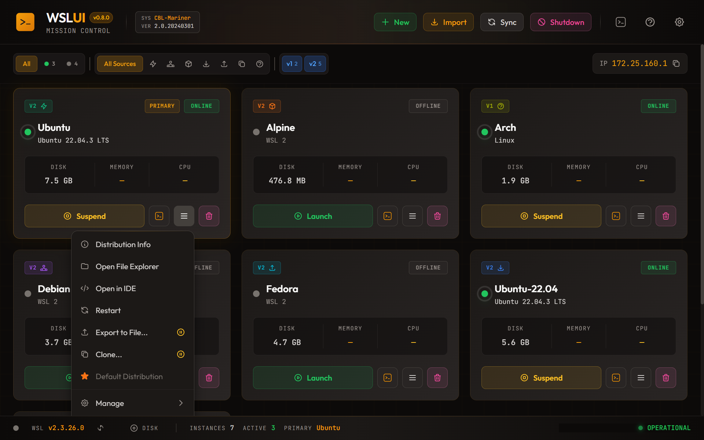

- **Open Terminal** - Launch a terminal session
- **Open File Explorer** - Browse files in Windows Explorer
- **Open in IDE** - Open in VS Code or your configured IDE
- **Restart** - Stop and start the distribution
- **Export** - Save to a .tar backup file
- **Clone** - Create a duplicate
- **Set as Default** - Make this the default distribution

### Manage Submenu

Advanced management options are in the Manage submenu:

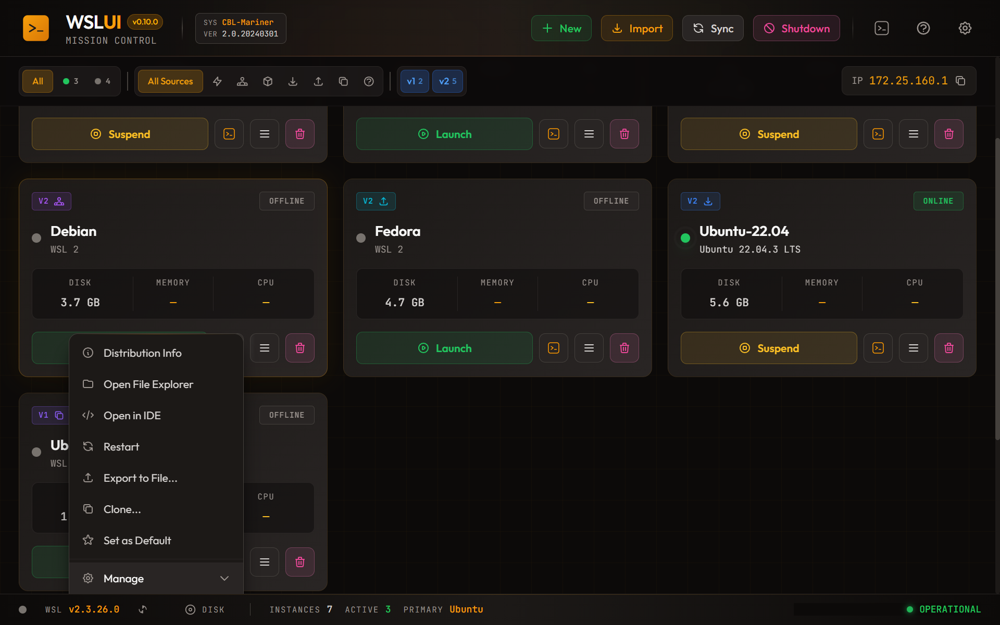

- **Move** - Relocate to a different drive
- **Resize Disk** - Expand the virtual disk
- **Compact Disk** - Reclaim unused space from the virtual disk
- **Set Default User** - Change the login user
- **Rename** - Change the distribution name
- **Sparse Mode** - Enable automatic disk reclamation
- **Set WSL Version** - Convert between WSL 1 and 2

### Compact Disk

Reclaim unused disk space from a distribution's virtual disk (VHDX):

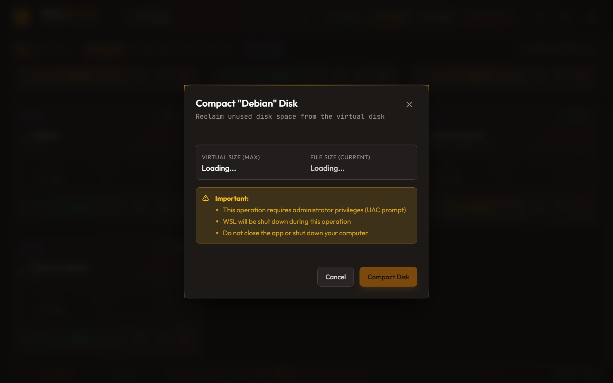

This operation performs three steps automatically:
1. **fstrim** - Zeros unused blocks inside the Linux filesystem
2. **WSL Shutdown** - Fully shuts down WSL to release file locks
3. **VHDX Compact** - Shrinks the virtual disk file on Windows

**Important notes:**
- Requires administrator privileges (UAC prompt will appear)
- WSL will be completely shut down during this operation
- Do not close the app or shut down your computer while compacting
- The operation typically takes 1-2 minutes depending on disk size

After completion, a notification shows how much space was reclaimed.

### Distribution Info

View detailed information about any distribution:

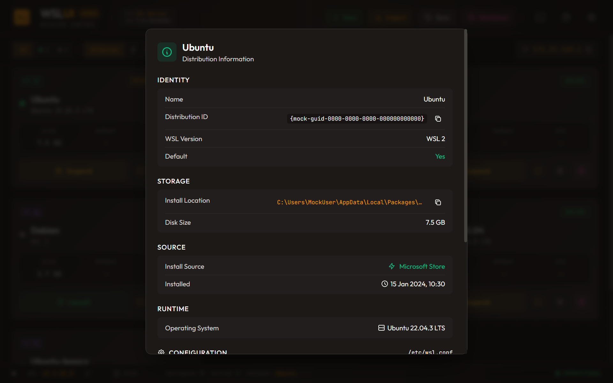

Shows installation location, creation date, disk size, and more.

---

## Installing New Distributions

Click **New Distribution** in the header to install from multiple sources.

### Microsoft Store

One-click installation of official distributions like Ubuntu, Debian, and Kali Linux.

### Container Images

Create distributions from Docker or Podman images. WSL UI includes a built-in OCI implementation - no Docker installation required.

### Community Catalog (LXC)

Browse hundreds of distributions from the Linux Containers image server.

### Custom Sources

Add your own rootfs download URLs with optional checksum verification.

---

## Backup and Restore

### Export

Export any distribution to a `.tar` archive for backup or sharing:

1. Open the Quick Actions menu
2. Select **Export to File**
3. Choose a save location

### Import

Restore a distribution from a backup:

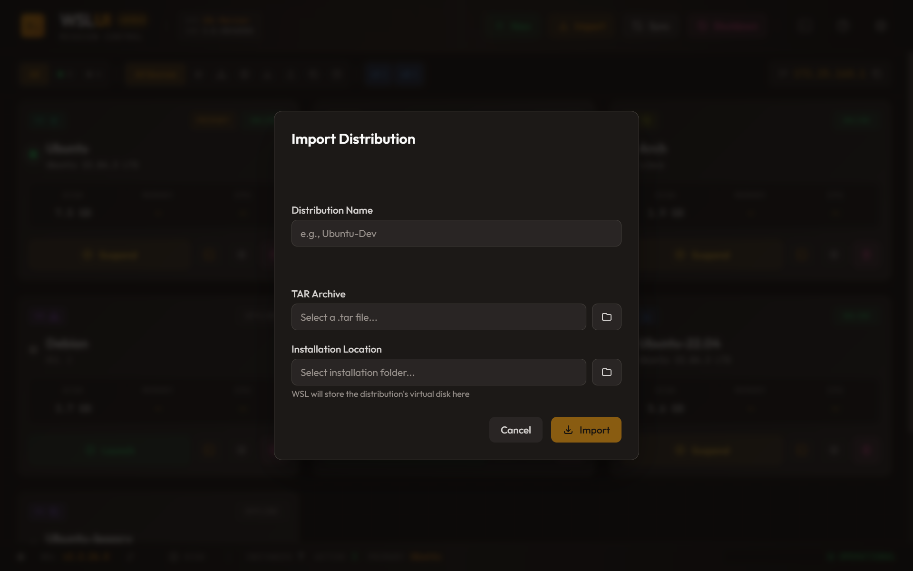

1. Click **Import** in the header
2. Select your `.tar` file
3. Choose a name and installation location

### Clone

Duplicate an existing distribution:

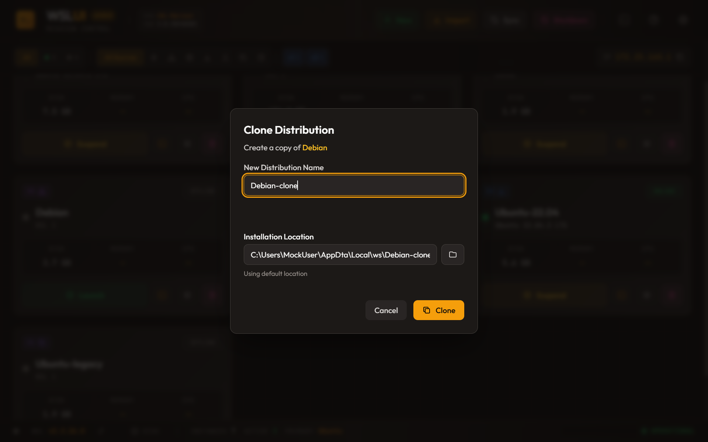

---

## Custom Actions

Create reusable commands that run inside your distributions.

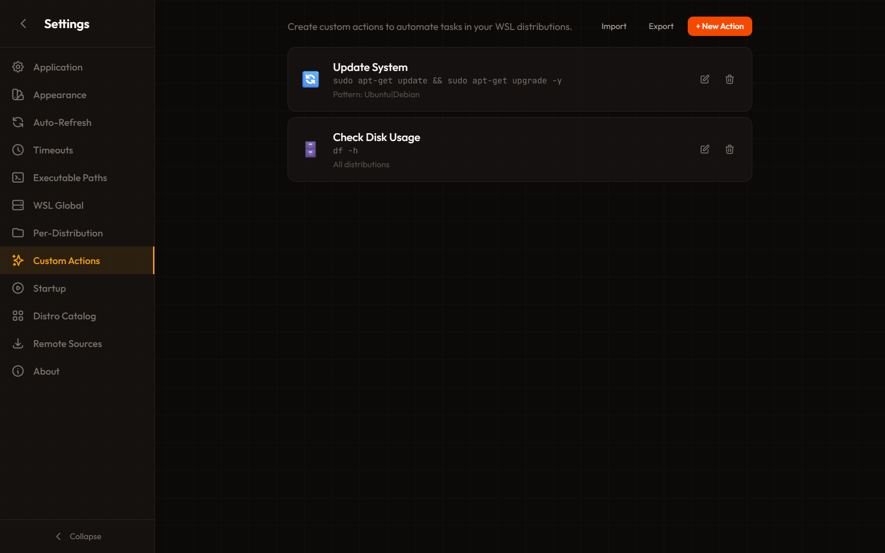

### Creating Actions

Each action has:
- **Name** and **Icon** for display
- **Command** with variable substitution
- **Target** - All distributions, specific names, or regex patterns
- **Options** - Run in terminal, require sudo, show output

### Variables

Use these variables in your commands:
- `${DISTRO_NAME}` - Distribution name
- `${HOME}` - Linux home directory
- `${USER}` - Default user
- `${WINDOWS_HOME}` - Windows home in WSL path format

---

## Settings

Access settings from the gear icon in the header.

### Application Settings

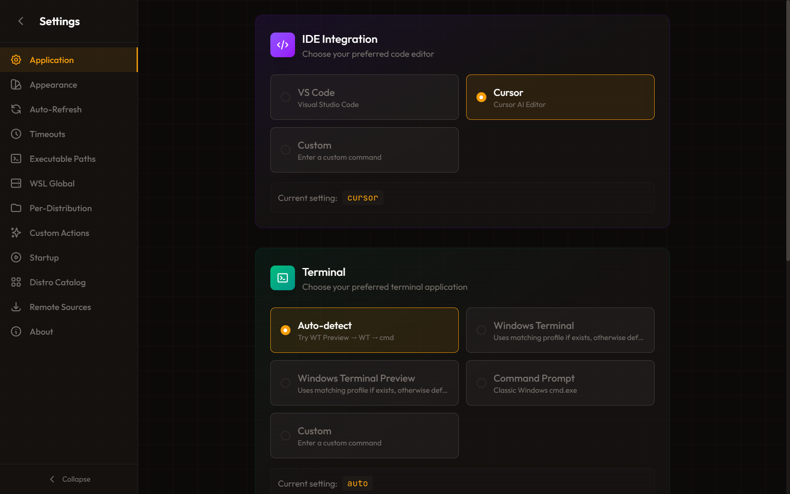

Configure your preferred terminal and IDE, startup behavior, and system tray options.

### WSL Global Settings

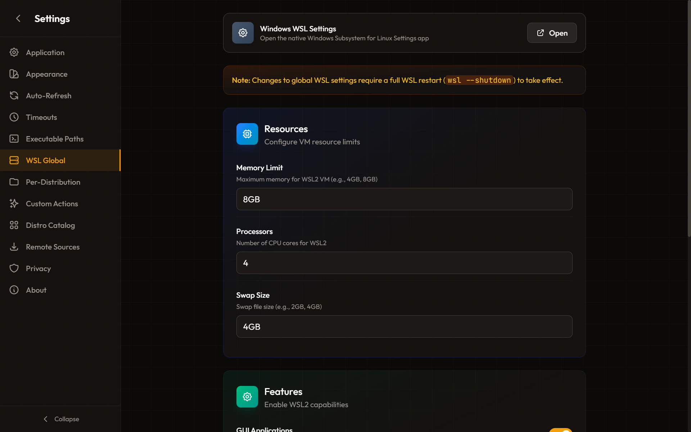

Edit `.wslconfig` settings that apply to all distributions:
- Memory and CPU limits
- Swap size and location
- GUI applications (WSLg)
- Networking mode

### Per-Distribution Settings

Edit `wsl.conf` settings for individual distributions:
- Automount options
- Network configuration
- Systemd and boot commands
- Windows interoperability

### Remote Sources

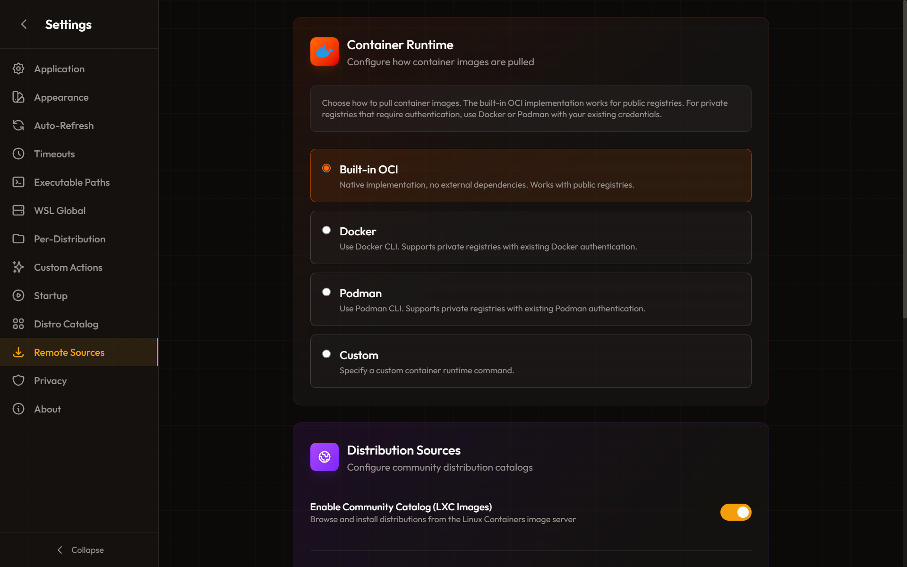

Manage distribution catalogs:
- Microsoft Store entries
- Custom download URLs
- Container image references
- LXC catalog settings

### Disk Mounting

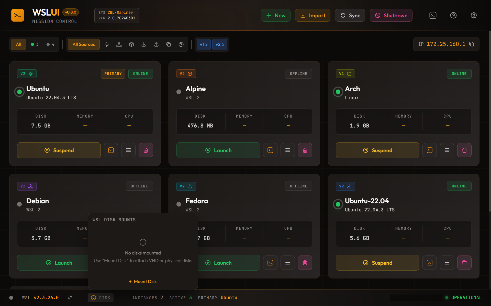

Mount VHD files or physical disks into WSL.

---

## Themes

WSL UI includes 17 built-in themes with full customization support.

### Built-in Themes

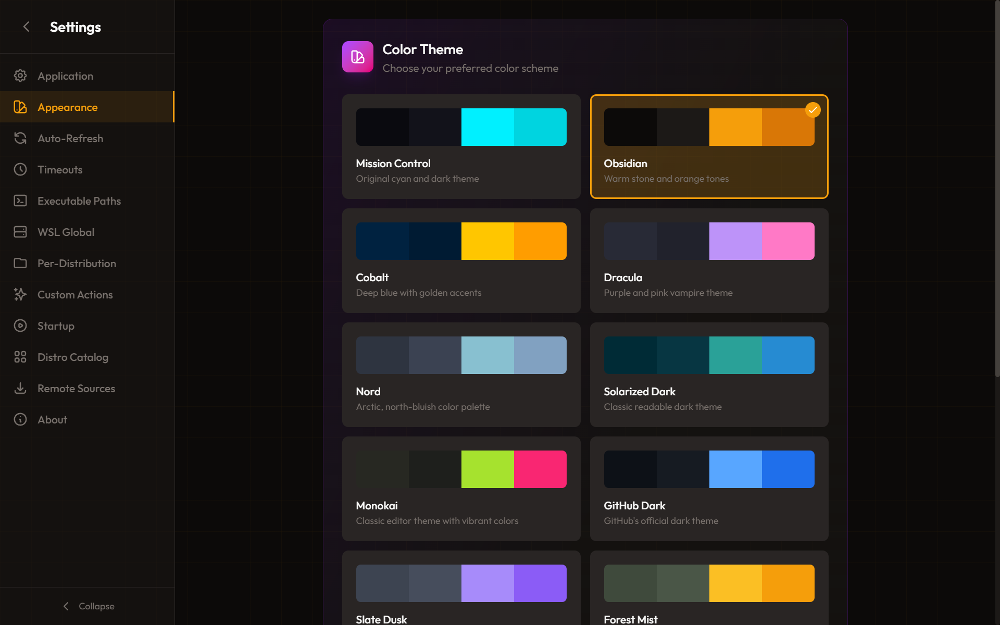

**Dark Themes:** Mission Control, Obsidian, Cobalt, Dracula, Nord, Solarized Dark, Monokai, GitHub Dark

**Light Themes:** Daylight, Mission Control Light, Obsidian Light

**Middle-Ground:** Slate Dusk, Forest Mist, Rose Quartz, Ocean Fog

**Accessibility:** High Contrast (dark), High Contrast Light - Maximum contrast themes for low vision users

### Theme Example

*Dracula - Purple/pink vampire theme*

### Custom Theme Editor

Create your own theme with the custom editor. Adjust 29 color variables across backgrounds, text, borders, accents, and buttons with live preview.

---

## Keyboard Shortcuts & Accessibility

WSL UI is designed to be fully accessible with keyboard navigation and screen readers.

### Navigation

| Key | Action |
|-----|--------|
| **Tab** | Move to next interactive element |
| **Shift+Tab** | Move to previous interactive element |
| **Enter** | Activate buttons, submit forms |
| **Space** | Toggle checkboxes, activate buttons |
| **Arrow Keys** | Navigate within menus and lists |

### Dialogs & Menus

| Key | Action |
|-----|--------|
| **Escape** | Close any open dialog or menu |
| **Enter** | Submit dialog form (when valid) |
| **Tab** | Navigate between dialog fields |

### Quick Actions Menu

| Key | Action |
|-----|--------|
| **Enter** or **Space** | Open menu from trigger button |
| **Escape** | Close menu |
| **Arrow Down/Up** | Navigate menu items |

### Accessibility Features

- **Screen Reader Support** - All dialogs announce their title, status changes are announced via ARIA live regions
- **Focus Management** - Focus is trapped within dialogs and returns to the trigger element when closed
- **High Contrast Themes** - Two high contrast themes available (dark and light) for low vision users
- **Reduced Motion** - Animations are disabled when system prefers reduced motion
- **Keyboard Navigation** - All features accessible without a mouse

---

## Troubleshooting

See [TROUBLESHOOTING.md](TROUBLESHOOTING.md) for solutions to common issues.

---

## More Information

- [Privacy Policy](PRIVACY.md)
- [GitHub Repository](https://github.com/octasoft-ltd/wsl-ui)
- [Report Issues](https://github.com/octasoft-ltd/wsl-ui/issues)
