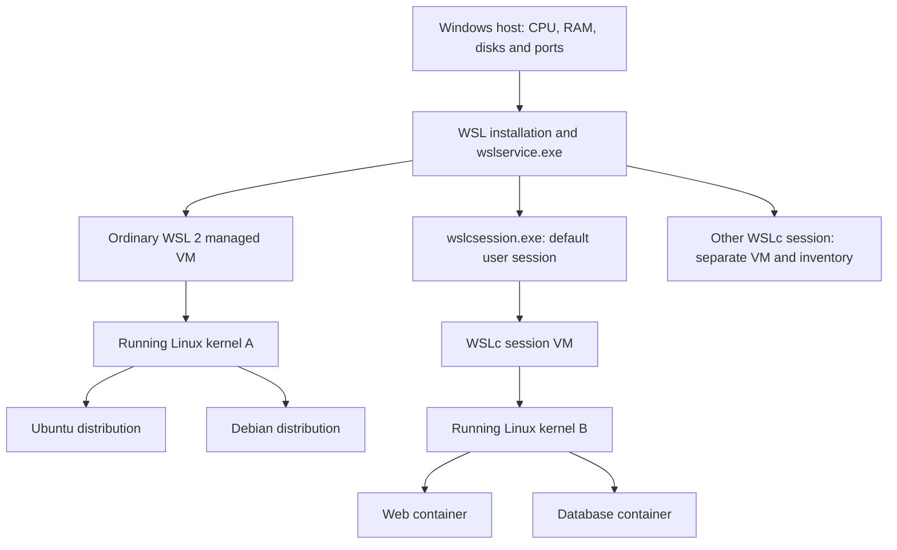
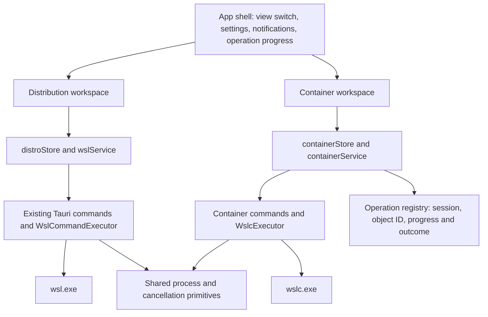

# WSL UI: distributions and containers in one app

Date: 2026-10-01
Status: approved design; implementation preview with the limits below
App baseline: `0969c35df63e02d2289a33570f30e8fe1cc3ad39`
WSLc reference: Microsoft WSL **3.0.1**, released 2026-09-29
Related issue: [#170](https://github.com/octasoft-ltd/wsl-ui/issues/170)
Companion: [feature sheet](2026-10-01-wsl-container-feature-sheet.md)

Competitor research: [WSL Container Desktop v2.0.1 comparison](2026-10-01-wsl-container-desktop-comparison.md)

### Implementation findings

The design below describes the intended release. Source review during implementation narrowed the preview:

- WSLc 3.0.1 container inspection omits effective creation settings including stop signal, DNS and terminal options. Native complete backup and configuration recreation are unavailable until those settings can be captured authoritatively. An app-origin label cannot establish completeness. The archive/restore implementation and UI are exercised through the stateful test runtime; this is not native recovery acceptance.
- The CLI addresses a session by name. Checking its numeric ID before and after a command detects replacement but cannot atomically prevent a write to a replacement session. Mutating operations report an uncertain outcome if the session changes during dispatch; users must reconnect and inspect before retrying. No automatic retry or cleanup in the replacement session is allowed. Full container IDs still protect against container name reuse. Atomic isolation requires a future adapter bound through `IWSLCSessionManager::OpenSession(id)`.
- The development host remains on WSL 2.9.9. Native stable-runtime compatibility and Linux metadata restoration remain release checks; the runtime was not upgraded.

These limits supersede stronger recovery and session-isolation statements in the target design. See [current behavior and verification](../../wsl-containers.md).

## 1. Brief and recommendation

The requested advancement is one WSL UI application with two views: **WSL distributions** and **WSL containers**. The container view should let someone create, run, start, stop, remove, back up and restore a container, edit simple configuration, read logs and open a terminal. Containers created outside WSL UI should be visible too.

Recommend a top-level two-way view switch. Preserve the existing distribution experience, add a small container workspace, and share presentation and application infrastructure. Keep separate domain models and command adapters. A container is not a distribution with extra flags.

Success means a user can run a small service from a public image, publish a local port, preserve its data, inspect a failure, and recover it from backup without learning the CLI. A CLI user should see the same containers in the app. Switching views must not stop workloads or recreate the runtime.

The first release manages the **current user's normal default WSLc session**. It does not promise visibility into every Linux container on the machine. Keep awareness of other accessible WSLc sessions, but postpone a general session manager. Docker and Podman runtime inventories remain independent.

### Approaches considered

| Approach | Benefit | Cost | Decision |
| --- | --- | --- | --- |
| Two views, shared shell, separate services | Familiar UI; clear state and operation boundaries; incremental delivery | Some container-specific components and stores | **Recommended** |
| One mixed list of distributions and containers | Everything appears together | Ambiguous actions, metrics, backups and shutdown scope; many irrelevant controls | Revisit only if users ask for a combined overview |
| Separate container app | Maximum independence | Duplicated settings, tray, distribution, updates and maintenance | Excessive for the requested extension |

This is a roadmap-level integration pathway, not an approved implementation checklist. Each delivery slice below should get a small implementation plan after the design is reviewed.

## 2. What is shared underneath Windows?

### Three different meanings of “shared kernel”

1. **Shared kernel components:** both architectures use Microsoft's WSL Linux kernel components by default. The stable source boots WSLc from the packaged kernel and modules; ordinary WSL can additionally select a custom kernel. A shared installation does not guarantee identical running versions when a VM predates an update or uses a custom kernel. See [WSLc VM setup](https://github.com/microsoft/WSL/blob/3.0.1/src/windows/service/exe/HcsVirtualMachine.cpp) and [ordinary WSL VM setup](https://github.com/microsoft/WSL/blob/3.0.1/src/windows/service/exe/WslCoreVm.cpp).
2. **Shared running kernel:** ordinary WSL 2 distributions run in the managed WSL VM. WSLc creates separate session VMs; containers inside one WSLc session share that session's running kernel. Do not draw one live kernel spanning the distribution VM and every WSLc session. Sources: [WSL 2 architecture](https://learn.microsoft.com/en-us/windows/wsl/compare-versions), [WSLc architecture](https://devblogs.microsoft.com/commandline/wslc-architecture-deep-dive/), and the VM setup code above.
3. **Shared application core:** WSL UI can share its shell, preferences, notifications, command execution plumbing and operation tracking across the two views. That is a software design choice, unrelated to sharing a Linux VM.



The diagram represents one user's ordinary WSL environment and example WSLc sessions. WSL 1 follows its older translation architecture and remains a distribution-view concern. **WSL package 3.0.1 is not a “WSL 3” distribution type.** Distribution version 1/2, WSL package version and Linux kernel version must remain separate fields.

### Consequences for the app

| Concern | Distribution view | Container view | Shared implication |
| --- | --- | --- | --- |
| Inventory | `wsl.exe`, distribution GUIDs | `wslc.exe`, session plus full container IDs | Independent refresh and errors |
| Running environment | Ordinary WSL VM | Selected WSLc session VM | Two VMs can consume memory concurrently |
| Persistent storage | Distribution filesystem/VHD | Session storage, image layers, writable layers and volumes | Different backup and space accounting |
| Configuration | `.wslconfig`, `/etc/wsl.conf` | WSLc user settings and container creation settings | Never silently copy one configuration into the other |
| Networking | Existing WSL settings | WSLc session networking and explicit published ports | Host ports can conflict across both views and other apps |
| Identity | Distribution GUID/name | Session context + full container ID | Names are labels, not global keys |
| Stop | Terminate a distribution | Stop a container's process | A scoped stop must not become a host-wide reset |
| Resources | Existing WSL/distribution measurements | Container stats; session metrics when supported | Do not sum overlapping VM and container memory figures |

Microsoft documents a session process and VHD for WSLc, with VirtioFS sharing and Consomme networking. The application should explain these only in diagnostics or settings where useful. They do not belong in the ordinary create flow. [Architecture source](https://devblogs.microsoft.com/commandline/wslc-architecture-deep-dive/)

WSLc 3.0.1 loads `%LOCALAPPDATA%\wslc\settings.yaml`. Its settings include session CPU, memory, storage path and networking. These are separate from `.wslconfig`; this release's WSLc VM path does not establish support for inheriting the distribution custom-kernel setting. [Settings implementation](https://github.com/microsoft/WSL/blob/3.0.1/src/windows/common/wslc/settings/WSLCUserSettings.h), [settings location](https://github.com/microsoft/WSL/blob/3.0.1/src/windows/common/wslc/settings/WSLCUserSettings.cpp)

## 3. Product layout and navigation

Use a persistent segmented switch immediately below the current header:

```text
WSL UI                                      Settings
[ WSL distributions ] [ WSL containers ]

Containers                       + Create   Restore backup
Default session · Connected      Search     All / Running / Stopped

web           nginx:stable        Running    localhost:8080
  Open    Terminal    Logs    Stop    More

database      postgres:18         Stopped    Data: database-data
  Start   Logs        Backup           More

WSL 3.0.1       Default container session       Updated just now
```

Image names here are examples, not an endorsed image catalogue or pinned production versions.

### Shared shell

- Keep the existing brand, themes, language, notifications, application settings and window/tray behaviour.
- Default existing users to distributions. Remember the last selected view once they choose containers.
- Preserve each view's search, filters, selection and scroll position while switching.
- Keep background operations in the application layer. Moving to distributions does not cancel a pull or backup.
- Split the present `Header` into shared branding/navigation and view-specific toolbars. It currently owns distribution dialogs and shutdown actions.
- Split the present `StatusBar` presentation from its distribution-specific measurements. Container status must not display a default distribution or a distribution mount count as its own state.
- Keep **WSL containers** discoverable even when unavailable. Show an explanation inside it; do not make support silently disappear.

Use **Distributions / Containers** as shortened labels at narrow widths, under the WSL UI brand. Do not label the pair “WSL2 / WSL3”. Switching views is navigation, not conversion.

### Container list and detail

The list uses familiar card styling initially. Each card shows name, image, state, health if supplied, published ports and a data summary. Origin is supplementary: “Created in WSL UI” or “Created elsewhere”. Both are manageable. Do not hide unlabelled containers.

The detail panel contains **Overview**, **Logs**, **Configuration**, and **Backups**. Show full ID and session under advanced details. At wide widths, use a contained side panel; at narrow widths, use a full-width detail page with Back. Menus stay within the app window, with collision handling and scrollable content.

Show state and health separately: a running container can be unhealthy. An unknown state disables destructive assumptions and offers Refresh. Missing data is “Unavailable”, not zero. Keep exit code and last error accessible on stopped/failed containers.

### Availability and connection states

| State | UI | Behaviour |
| --- | --- | --- |
| WSL unavailable | Existing setup guidance | Distribution and container prerequisites remain distinct |
| WSLc missing or package below 3.0.1 | “Update WSL to use containers” | No automatic update; existing distro operations remain available |
| Disabled by organisation | Explain policy restriction | No fallback that bypasses the policy |
| Supported, not connected | “Connect to containers” | Explain that connecting may start the container environment |
| Connecting | Progress with cancellation | No automatic repeated session creation |
| Connected, empty | Create / Restore backup | Empty is a successful result |
| Connected, populated | List and actions | Include outside-created containers |
| Lost session or service unavailable | Retain stale rows with clear status | Disable writes; reconnect intentionally |

Detection starts with version and capability probes. The 3.0.1 `system info --format json` path enumerates sessions without invoking default-session creation; this needs a live confirmation before relying on it for passive discovery. In contrast, `container list` resolves a session and can create the default one. [Session tasks](https://github.com/microsoft/WSL/blob/3.0.1/src/windows/wslc/tasks/SessionTasks.cpp), [session service](https://github.com/microsoft/WSL/blob/3.0.1/src/windows/wslc/services/SessionService.cpp)

WSLc does not require an installed user distribution. Keep its readiness checks independent of the existing default-distribution checks; an empty distribution list must not block the container workspace.

First connect is explicit. Remembering the view must not imply permission to recreate a stopped session on every application start. After connection, resolve the selected session and use an explicit session target for follow-up reads and writes. If it disappears, return to disconnected instead of silently selecting a new default session.

## 4. Everyday workflows

### Create and run

One dialog, with **Basics** visible and **Ports**, **Data**, **Environment**, and **Advanced** disclosure sections:

- Image reference, name and “Start after creating” (on).
- Published ports: container port, host port, protocol; bind to `127.0.0.1` by default. Exposing to the network is an explicit choice.
- Data: create/use a named volume, or select a Windows folder; require a container path. Existing folders default to read-only; users can select writable access.
- Environment: structured key/value rows with values masked by default. Do not log them or retain them in ordinary preferences.
- Advanced: argument-list command override, working directory, user and optional container CPU/memory limits, subject to verified CLI support.
- Normal creation retains the container when it stops. Do not use `--rm` for persistent services.

Resolve the selected image and inspect declared volumes before creation. If an image declares persistent paths, ask how to store them and prefer explicit named volumes; avoid accidentally creating untracked anonymous data. Do not publish every exposed port automatically.

Flow: validate -> pull if needed -> resolve immutable image identity -> review any discovered data requirements -> create -> start if requested -> inspect. Keep real stages rather than inventing percentage progress. A successful create followed by a failed start leaves a visible stopped container with Retry and Remove.

The backend generates arguments from a typed request. It never accepts a shell command string from the webview. Image reference, name, ports, paths and environment keys each get their own validation. CLI side effects are re-inspected after timeouts before retrying.

### Outside-created containers

Yes: `wslc container list --all --format json --no-trunc` is the inventory equivalent of `wsl --list` **within a WSLc session**. It includes stopped containers and those created from a terminal or another client. The app must not filter its main list to its own labels.

The initial release operates in the normal default session for the app's Windows user/token. An elevated terminal can use a different default session; SDK applications can have custom sessions. Explain this boundary in the empty state and troubleshooting. Do not request elevation to collect all sessions. Docker/Podman container inventories require their own integrations.

External creation, start, stop, rename/removal and session loss must update the view. A container name reused after removal is a new object. Operations always use full IDs and the session captured when the operation began.

### Start, stop, restart and remove

- Start and restart confirm actual state by inspecting after completion; a successful command does not guarantee that a service remains running.
- Graceful stop has a visible timeout. If it fails, present Force stop as a separate action. Never force automatically because polling timed out.
- Remove uses a confirmation naming the container and identifying writable-layer loss. Retain named volumes and images by default.
- “Stop all containers” targets the captured list in the current session. Report partial failures. It does not terminate the session or run `wsl --shutdown`.
- Keep global WSL shutdown/recovery in an advanced, clearly scoped action. Before implementation, measure its effects on WSLc and Docker/Podman backends on the stable release. A service restart can have wider effects than stopping one distro.

### Logs and terminal

Logs open with a bounded recent tail, timestamps, follow/pause, clear display, copy and explicit save. Escape rendered content; never interpret it as HTML. Keep a capped ring buffer and cancel the follower when its viewer closes. Empty logs, unsupported logging and permission failure are distinct states. Saving logs can expose application data and requires the user's chosen path.

Terminal opens the user's selected external Windows terminal with a WSLc exec invocation. Try `/bin/sh`, with an editable executable/argument option if unavailable. Minimal images can have no shell; explain that failure without installing one. A stopped container offers Start first. Do not implement a browser terminal emulator for the first release. Verify terminal quoting for spaces, Unicode and Windows Terminal separators independently of ordinary process arguments.

### Simple configuration

Show ports, volumes, environment, user and command. Many creation settings require **recreating** the container. Use that word and provide a change review; do not present a misleading live Save button.

For first release, editing is supported only for configurations that the adapter can fully round-trip. Stop the original after confirmation, create the replacement under a new name with the same data mounts and new settings, and retain the stopped original until the replacement is accepted. Suggest a name such as `web-updated` and preview port conflicts. A same-name replacement transaction is a later feature unless a reliable rename and recovery path is verified. An external container with unsupported settings is inspectable and manageable, but its configuration editor is read-only with the unsupported fields listed. Never drop configuration silently.

Automatic image updates, general clone operations and automatic rollback after an application changes a shared volume are outside this first release. Keeping the old container is not a data rollback guarantee.

## 5. Backup and restoration contract

Backup is included in the requested first release. It is also the most substantial part of this proposal. Ship backup and restore together, with narrower supported cases where necessary.

### What the user can rely on

**Container backup** captures a stopped container's filesystem, a reconstructable creation specification and supported persistent named volumes. It does not capture running memory. The first supported set is ordinary containers with no mounts, or local named volumes that the backup adapter can archive and restore with Linux ownership and permissions intact.

Windows bind mounts, external volume drivers, device mounts, tmpfs and configuration the adapter cannot reproduce are reported before backup. First release blocks a “complete backup” claim for these cases. It may offer a separately labelled **Export filesystem only**, with the omissions explicit. A filesystem export is not a complete application backup. Docker documents the same volume omission for its export command; WSLc's exact behaviour must be verified by a restore test rather than inferred from command similarity. [Export semantics](https://docs.docker.com/reference/cli/docker/container/export/)

### Proposed format

Use a versioned `.wslcbackup` bundle containing:

```text
manifest.json          schema, app/runtime versions, platform, timestamp,
                       source identity, completion state, data inventory,
                       exclusions and checksums
container.json         supported effective creation specification
rootfs.tar             filesystem snapshot, without assuming image history
volumes/<key>.tar      supported persistent volume contents
```

The outer archive is application-owned; archive members have fixed, validated names. Root filesystem restoration produces a new local image from the snapshot, then reapplies captured process/environment/port/mount configuration. Record that original image layer history and registry signatures are not preserved. Do not promise that importing a filesystem reproduces every OCI configuration field automatically.

Backups can contain passwords, keys and application data, including in filesystem contents. Use a user-selected destination with normal user-only staging permissions, exclude registry credentials, redact operation logs and avoid telemetry of names/paths/configuration. V1 does not promise archive encryption. Provide an explicit choice about storing environment values; if omitted, list the values that must be re-entered on restore. Do not claim completeness without that qualification.

### Backup transaction

1. Inspect container and every mounted data source; produce a coverage report and required stop list.
2. Detect all containers in the selected session sharing a captured volume. Require all writers to stop for a consistent filesystem capture. If exclusivity cannot be established, refuse a consistent-backup claim.
3. Confirm graceful stopping and whether to restart previously running containers afterwards. Abort if stopping fails. Warn that another client must not write during the capture; an app lock cannot control external clients.
4. Export the stopped root filesystem. Archive volumes through a temporary, pinned helper container with only the required volume and staging access. The helper implementation, Linux metadata preservation and policy compatibility must pass the feasibility gate before enabling this feature. Never copy a live session VHD.
5. Verify checksums and manifest, publish the completed bundle atomically, and clean up only helper resources owned by the operation. Interrupted bundles remain visibly incomplete and cannot restore as complete backups.
6. Restart only those workloads the user asked to resume. A successful backup with a failed restart is reported as two separate outcomes.

Use a helper image pinned by digest after selection and validation, with amd64/arm64 availability. Do not bypass a registry allowlist to obtain it. Registry restrictions or missing helper support disable the affected backup path with a useful explanation. No helper image is selected or downloaded by this design task.

### Restore transaction

Validate schema, platform, archive structure, checksums, member sizes and capacity before allocating resources. Reject traversal, duplicate control files and malformed manifests. Restore Linux archives inside isolated Linux targets, never by extracting their arbitrary paths into the Windows filesystem.

Restore uses a new name, new image reference and new volumes by default. It never overwrites existing data. Preview host-port conflicts and folder mappings. Re-enter omitted environment values. Leave the restored container stopped until validation completes; starting it is explicit because restored code will execute. Track resources allocated by this attempt so failures offer precise cleanup without deleting pre-existing volumes.

Acceptance requires a real round trip, including user/group IDs, modes, symlinks, hardlinks, Unicode names, sparse files, supported xattrs/ACLs and a stopped database with a named volume. Where the archive method cannot preserve a property, either fix it or exclude that case explicitly. Backups of arbitrary running databases are not promised; application-level dumps are a future workflow.

## 6. Application architecture and integration points



### Reuse and separation

| Existing area | Proposed change |
| --- | --- |
| `src/App.tsx` | Keep lifecycle bootstrap; introduce workspace selection and shared dialog/notification host |
| `src/components/Header.tsx` | Extract shared header chrome; retain existing distro actions in `DistributionToolbar` |
| `src/components/StatusBar.tsx` | Shared outer layout with distinct distro and container status content |
| `src/components/DistroList.tsx`, `DistroCard.tsx` | Preserve behaviour; reuse small visual primitives, not their domain logic |
| `src/store/distroStore.ts` | Remains distro-specific; no container entries in `Distribution[]` |
| `src/services/wslService.ts` | Remains distro-specific; add a sibling `containerService.ts` |
| `src/types/distribution.ts` | Keep distro GUID and WSL version semantics; add separate `containers.ts` |
| `src/store/pollingStore.ts`, `src/types/polling.ts` | Existing poll types are fixed to distros/resources/health; add separate container refresh lifecycle first |
| `src-tauri/src/commands.rs` | Add sibling `container_commands.rs` instead of growing the existing large file |
| `src-tauri/src/wsl/executor/` | Follow the real/mock adapter pattern in a separate `containers/executor` module |
| `src-tauri/src/main.rs` | Register typed commands; add explicit tray groups after inventory is reliable |
| `src-tauri/src/oci/` and `wsl/install.rs` | Retain image-to-distro import; WSLc owns its own pull/create storage path |
| `crates/wsl-core` | Keep its current distro parsing/types role; do not rename or generalise it merely for symmetry |
| Settings, translations and E2E | Add namespace and mock container fixtures; preserve old saved settings and distro tests |

Proposed new modules: `components/containers`, `store/containerStore.ts`, `store/containerOperationStore.ts`, `services/containerService.ts`, `types/containers.ts`, and `src-tauri/src/containers/{types,executor,inventory,lifecycle,logs,backup}.rs`. Paths describe responsibilities; implementation may consolidate small modules.

The existing `ContainerRuntimeSettings` selector (built-in/Docker/Podman/custom) selects an image source for creating distributions. It does not manage those engines' containers. Clarify its label/help as part of integration so it cannot be mistaken for the new workspace's runtime selector. Likewise, the existing `InstallSource: "container"` records an image-derived distribution; it must not route that distribution into the container inventory.

Start with the CLI rather than a Rust wrapper over the native SDK. It fits the existing executor pattern, provides observable command contracts and avoids a new interop layer. Keep the service interface independent of the CLI so a measured future SDK advantage can justify a replacement. Do not build a generic Docker/Podman/WSLc engine framework in advance.

### Types and operation contracts

```typescript
type Workspace = "distributions" | "containers";

interface ContainerRef {
  sessionKey: string;       // backend-resolved user/token/session context
  sessionGeneration: string; // changes when the live session is replaced
  id: string;              // full runtime ID, never a truncated display ID
}

interface ContainerSummary {
  ref: ContainerRef;
  name: string;
  image: string;
  state: "created" | "running" | "paused" | "restarting" |
         "exited" | "removing" | "dead" | "unknown";
  health: "none" | "starting" | "healthy" | "unhealthy" | "unknown";
  origin: "wsl-ui" | "external";
  observedAt: string;
}

interface OperationRef {
  id: string;
  workspace: Workspace;
  target: ContainerRef | { distributionId: string };
}
```

These are app-owned normalized types, not a claim that every listed state is emitted by 3.0.1. Preserve unknown upstream values for diagnostics. Session generation invalidates stale actions; persistent backup metadata stores the historical source identity without assuming it remains addressable.

Backend operations return structured error categories such as unavailable, unsupported, permission/policy, not found, conflict, timeout, cancelled and command failed. Preserve a redacted diagnostic detail and exit code. One failed container does not poison the distro store or clear a healthy container snapshot.

Do not allow concurrent stop/remove/backup/recreate on the same target. Reads can run concurrently within a small limit. Session-level actions serialize against all in-flight operations for that session. Use an operation ID to reject stale results after navigation or session replacement.

### CLI contract traps verified in 3.0.1

| Command/path | Contract | Design consequence |
| --- | --- | --- |
| `container list --all --format json --no-trunc` | Emits individual JSON objects on separate lines; empty output is possible | Parse NDJSON; never assume one JSON array |
| `container inspect <id>` | Emits a JSON array | Different decoder from list; preserve exact field casing at the boundary |
| `system info --format json` | One JSON object, including client and session information | Use for supported passive discovery; handle service failure explicitly |
| `container stats --format json --no-trunc` | Snapshot records emitted per line; no `--no-stream` argument registered | Do not copy Docker flags; bounded polling only while useful |
| `container list` without explicit session | Can create/open default session | No eager list call from distro startup or unconnected tray |
| `container create` | Has explicit environment, mounts, ports, CPU/memory and labels | Generate a typed allowlisted argument vector |

Sources: [list command](https://github.com/microsoft/WSL/blob/3.0.1/src/windows/wslc/commands/ContainerListCommand.cpp), [container task serialization](https://github.com/microsoft/WSL/blob/3.0.1/src/windows/wslc/tasks/ContainerTasks.cpp), [stats arguments](https://github.com/microsoft/WSL/blob/3.0.1/src/windows/wslc/commands/ContainerStatsCommand.cpp), [create arguments](https://github.com/microsoft/WSL/blob/3.0.1/src/windows/wslc/commands/ContainerCreateCommand.cpp).

The list's ports, size and some timestamps are presentation strings. Use inspect data for typed port/mount configuration and backup metadata; do not scrape formatted columns. Stream parsing must handle split UTF-8 sequences, fragmented lines, bounded record size, unknown fields and nonzero exit with partial stdout. Never silently discard an invalid line and report a complete inventory.

### Process, monitoring and lifecycle

- Spawn the resolved Microsoft executable directly with argument arrays. No `cmd /c` or PowerShell evaluation for ordinary operations. Use stdout for data and stderr for diagnostics; check exit status.
- Give queries short configurable timeouts, and pulls/backups explicit long-operation management. Cancellation kills the client process tree the app owns, not `wslservice` or the session VM. It can leave runtime work or resources behind; reconcile before reporting outcome or retrying.
- First release can use a serialized inventory refresh every 5 seconds while visible and connected, with refresh after actions. Back off on errors and stop polling disconnected sessions. Stats run only when shown, no more often than every 5 seconds initially.
- Pause container queries when the app is hidden unless a user-enabled container tray monitor or operation needs them. A read loop can keep a session alive; verify idle behaviour.
- Events are an enhancement after the snapshot baseline works. Subscribe, reconcile a full snapshot and coalesce event-triggered refreshes; reconnect and periodically reconcile to cover lost events. Never make event order the only source of truth.
- Keep at most one event follower per observed session and one log follower per open log panel. Switching views preserves operations but closes unneeded viewer subscriptions.
- Closing WSL UI leaves containers running. Tray quick actions include workspace and object identity. Closing a view must never terminate a container session.
- Label session metrics separately from container metrics. A CPU percentage may exceed 100% across cores; explain the convention. Do not add container memory to its containing VM's memory total.

## 7. Integration pathway

### Slice 0: stable-runtime feasibility and fixtures

Use an isolated Windows test environment with WSL 3.0.1 or newer stable, on x64 and ARM64 where available. This machine's inspected 2.9.9 help is useful historical evidence, not a stable-runtime validation.

Capture actual outputs for version, system info, list/inspect/stats/events, empty and stopped sessions, default versus elevated/custom sessions, and error exits. Measure which probes create VMs. Verify `wsl --shutdown`, forced recovery and WSL service restart scopes. Run a backup/restore proof covering one named volume and a data-bearing service before promising the complete backup route.

Deliverable: sanitized fixtures, an explicit capability matrix and a decision on supported backup cases. A blocker here narrows a feature honestly; it must not be hidden behind a mock.

### Slice 1: two views and inventory

Extract the shell with existing distro tests intact. Add capabilities, connection states, default-session inventory, full-ID mapping, details and visibility of external containers. No user environment changes from merely opening the distribution view.

Deliverable: internal read-only preview. It is not the complete requested release.

### Slice 2: lifecycle, logs and terminal

Add start, stop, restart, remove, structured errors, per-object operation locks and external terminal launch. Validate rapid state changes and containers deleted from another client. Add bounded logs and cleanup checks.

Deliverable: useful internal management build; no claims of backup or creation support yet.

### Slice 3: create and simple configuration

Add pull/create/start, local ports, named data volumes, bind mounts and environment. Track resources created by failed attempts. Add supported configuration recreation, with read-only fallback for unsupported external specifications. Add explicit current-session stop-all if its semantics are validated.

Deliverable: first end-to-end service workflow, including restart of the app without data loss.

### Slice 4: backup and restore

Implement the versioned bundle, coverage report, quiescing, validated helper, atomic completion, restoration under new identities and failed-operation cleanup. Prove round trips before release. Keep unsupported mount classes explicit.

Deliverable: the complete requested first-release feature set. If this slice is delayed, any earlier public preview must clearly disclose that backup is still unavailable.

### Slice 5: release integration and optional follow-ups

Add bounded tray integration, event-driven refresh, translations, documentation and the full desktop regression run. Test with WSLc disabled and older WSL installations as well as the stable runtime. Later candidates: image/volume management, multiple sessions, templates, build workflows, native Compose when available, and broader backup data sources.

### Effort and scope assessment

| Area | Relative effort | Main uncertainty |
| --- | --- | --- |
| View switch and shared shell | Small to medium | Current header/status coupling |
| Inventory and lifecycle | Medium | Session lifetime and changing CLI schemas |
| Logs and external terminal | Medium | Cancellation, terminal quoting and missing shells |
| Create/configuration | Medium to large | Image defaults, mounts and recreate semantics |
| Backup and restore | Large | Data consistency, Linux metadata and supported volume types |
| Multi-session/Compose/Kubernetes | Separate projects | Not required for the first release |

The two views are a small visual change. Reliable runtime management and restoration account for most engineering work. No calendar estimate is asserted before the feasibility slice.

## 8. Validation and release criteria

### Parser and service tests

- Stable JSON fixtures for each command, including empty NDJSON, arrays, missing/unknown fields, truncated output, CRLF, non-English Windows, Unicode and permission/policy errors.
- Command arguments for image names, environment, paths with spaces, `;`, quotes and leading option-like values. Terminal launch tested separately.
- Per-target operation serialization; session-generation invalidation; timeout reconciliation; partial bulk failure; removal outside the app.
- Backup rejects unsupported coverage and corrupted/unsafe archives. Restore never overwrites existing IDs, images or volumes.

### UI and mocked desktop tests

- Switch views without losing filter state; notifications identify their workspace; settings return to the previous view.
- Missing/old/disabled WSLc never blocks distro operations. No container executor call from a disconnected distro-only launch.
- External containers are shown. Failed starts, stale snapshots, unhealthy-but-running and shell-less images have useful states.
- Logs are bounded and viewer processes stop on close. Operations continue across view changes. Quit does not stop workloads.
- Keyboard and screen-reader navigation, light/dark themes, long translations, RTL, scaling and minimum window size. Menus remain inside the app container.

### Real stable-runtime tests

Create via CLI and observe in WSL UI; create via UI and inspect with CLI; stop/start from each side; remove externally; graceful/forced stop; local-port binding and collision; named-volume persistence; bind-mount permissions; terminal and logs; interrupted pull; restart app; idle session disappearance; default/elevated/custom separation; policy denial; host recovery scope.

Backup a data-bearing test container, destroy only that test workload and restore under new identities. Verify filesystem hashes, configuration and data inside the restored workload. Simulate a corrupt bundle, low disk space, partial export, occupied ports and a failed resume. A mock round trip alone cannot satisfy this criterion.

Use test-owned sessions/resources and names, with explicit before/after inventories. Never run global shutdown or destructive recovery experiments against the user's production environment. Existing full distro E2E remains required before release.

## 9. Evidence and open implementation gates

### Checked during this design

- Active GitHub account: `octasoft-ltd`; issue #170 and stable Microsoft release metadata read.
- WSL UI source inspected at the baseline above, including App, Header, StatusBar, stores, services, executors, OCI installation and shared Rust crate.
- Microsoft WSL 3.0.1 source inspected for session resolution, settings, VM creation, command arguments and JSON output shape. Source copies are in `.cache/wslc-design` for local reference.
- Local version/help only: WSL 2.9.9; no container/session creation, update, shutdown, pull, export or data mutation performed.
- The companion UI is an interaction mockup with sample data; it cannot operate WSL.
- Mockup checks cover switching views, external inventory, creation, start/stop, logs, backup/restore, removal confirmation and settings. Browser inspection checks the rendered layout; these checks do not establish runtime compatibility or real backup correctness.

### Gates that remain unproven

1. Runtime behaviour of passive discovery, default-session resolution and idle lifetime on stable WSL.
2. Actual blast radius of all existing app recovery/shutdown commands with containers running.
3. Backup helper feasibility, policy access, Linux metadata fidelity and restore of supported creation fields.
4. x64/ARM64 and supported Windows compatibility; architecture matching does not imply emulation support.
5. Exact terminal launch and cancellation behaviour under Windows.

These are planned validations, not verified compatibility claims. GA announcement: [WSL Containers release](https://blogs.windows.com/windowsdeveloper/2026/09/29/wsl-containers-now-generally-available/). Stable source baseline: [3.0.1](https://github.com/microsoft/WSL/releases/tag/3.0.1).

## 10. Proposed decisions for review

1. Adopt two top-level views within the existing app.
2. Use the normal default WSLc session for release one; show all its containers regardless of origin.
3. Use separate typed backends with shared UI and process/operation infrastructure.
4. Include restore with backup; require an explicit data-coverage report.
5. Target stable WSL 3.0.1+ for containers while retaining existing distro compatibility.
6. Complete the feasibility slice before fixing the supported backup matrix or scheduling release.

No product code, dependency, PR, issue status or existing branch commit is changed by this proposal.
